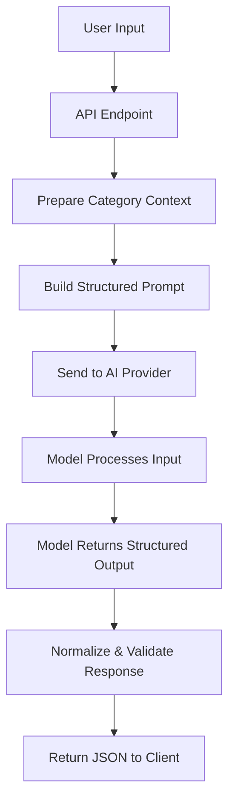

# AI Classification Service

> A flexible, AI-powered classification service designed to interpret unstructured input and map it into structured categories for various business use cases.

## 🎯 TL;DR

This service uses AI to automatically classify text inputs (issue reports, employee profiles, requests) into predefined categories with explanations and confidence scores. Built with a provider-agnostic architecture, it's designed to support multiple domains: IT support, HR workflows, salary structures, and more.

---

## 📊 Current Status

- ✅ Initial monorepo setup complete (based on [starter-kit](https://github.com/yurisasc/starter-kit))
- ✅ OpenRouter API integration with Hono + LangChain
- 🚧 Building classification prompt templates
- ⏳ Category knowledge store design
- ⏳ Response normalization layer
- ⏳ Frontend UI for testing

---

## 💡 Core Concept

The service receives unstructured text and classifies it into predefined categories using curated domain knowledge. Instead of hardcoding business logic, we let AI interpret and map inputs while maintaining full transparency and auditability.

### Example Use Cases

- **IT Operations**: Categorize support tickets (Network, Hardware, Software, Security)
- **HR Management**: Suggest salary structures based on employee profiles
- **Performance Reviews**: Classify feedback into performance tiers
- **Document Routing**: Auto-categorize incoming documents for proper workflow

### Quick Example

**Input Request:**
```json
{
  "text": "My laptop won't connect to WiFi after the latest update",
  "domain": "it-support"
}
```

**Classification Response:**
```json
{
  "category": "Network Connectivity",
  "confidence": 0.89,
  "explanation": "Issue involves WiFi connection problems following a system update. Likely driver or configuration related.",
  "suggestedPriority": "medium",
  "metadata": {
    "matchedCriteria": ["wifi", "connectivity", "update"],
    "modelVersion": "gpt-4-turbo",
    "timestamp": "2024-11-19T10:30:00Z"
  }
}
```

---

## 🏗️ Architecture Overview

The system follows a modular, layered architecture:

### 1. Input Layer
Accepts text from any source: web apps, APIs, internal tools, browser extensions, CLI tools.

### 2. Knowledge & Category Store
Contains curated domain knowledge:
- Category definitions and descriptions
- Classification criteria
- Domain-specific rules
- Constraint definitions

This acts as a mini "domain knowledge base" that gives the AI model context.

### 3. AI Connector Layer
Provider-agnostic layer that:
- Constructs structured prompts
- Manages API calls to different AI providers
- Handles responses and errors
- Enables easy provider switching (OpenAI, Anthropic, OpenRouter, etc.)

### 4. Classification Core
Applies business logic:
- Prepares category context from knowledge store
- Maps inputs to appropriate categories
- Enforces output schema validation
- Normalizes model responses

### 5. Client Layer
Any interface consuming classification results: dashboards, UIs, integrations.

---

## 🔄 Classification Flow



### Step-by-Step Process

1. **Input Received** - Raw text arrives via API
2. **Context Preparation** - Load relevant categories, criteria, and rules
3. **Prompt Construction** - Build structured prompt with input + context
4. **AI Classification** - Send to model and receive structured output
5. **Response Normalization** - Validate and format for client consumption

---

## 🗂️ Project Structure

```
ai-classifier/
├── apps/
│   ├── api/              # REST API server (Hono)
│   ├── auth/             # Authentication server (Better Auth)
│   ├── docs/             # Documentation site (Fumadocs)
├── packages/
│   ├── biome-config/     # Shared linting/formatting
│   ├── database/         # Database client & migrations
│   │   └── categories/   # Category definitions by domain
│   └── typescript-config/# Shared TypeScript config
└── specs/                # Feature specs & documentation
```

---

## 🚀 Quick Start

### Prerequisites

- Node.js (v18+)
- pnpm (v9.0.0+)
- Docker
- OpenRouter API key

### Installation

```bash
# Clone the repository
git clone https://github.com/galih56/issue-classifier-ai-agent.git
cd ai-classifier

# Install dependencies
pnpm install

# Setup environment variables
pnpm setup:env

# Start PostgreSQL database
docker run -d \
  --name auth-postgres \
  -e POSTGRES_PASSWORD=password \
  -e POSTGRES_DB=auth_db \
  -p 5432:5432 \
  postgres:18

# Setup database schema
pnpm db:setup

# Start development servers
pnpm dev
```

### Access Points

- **Documentation**: http://localhost:3000
- **Auth Server**: http://localhost:3001
- **API Server**: http://localhost:3010
- **Drizzle Studio**: https://local.drizzle.studio

---

## 🛠️ Technology Stack

### Why These Technologies?

- **Hono**: Lightweight, edge-ready, TypeScript-first framework
- **LangChain**: Structured prompt management and AI workflow orchestration
- **OpenRouter**: Provider flexibility without vendor lock-in
- **PostgreSQL + Drizzle ORM**: Type-safe database operations
- **Better Auth**: Modern authentication with JWT validation
- **Turborepo**: Efficient monorepo builds and caching

### Core Dependencies

- **Backend**: Hono, Better Auth, LangChain
- **Database**: PostgreSQL with Drizzle ORM
- **Frontend**: React with Fumadocs UI
- **Build Tools**: Turborepo with pnpm workspaces
- **Dev Tools**: Docker, Drizzle Studio, Scalar API docs

---

## 📖 Key Concepts

### Category Structure

Each category in the knowledge store includes:

```typescript
{
  id: string;
  name: string;
  description: string;
  criteria: string[];
  constraints?: string[];
  severity?: "low" | "medium" | "high" | "critical";
  examples: string[];
}
```

### Response Schema

```typescript
{
  category: string;
  explanation: string;
  confidence: number; // 0-1 scale
  metadata: {
    matchedCriteria: string[];
    modelVersion: string;
    timestamp: string;
  }
}
```

---

## 🎨 Design Philosophy

1. **Avoid Over-Engineering**: Start simple, add complexity only when needed
2. **Inspectable & Auditable**: Every classification includes reasoning
3. **AI for Interpretation Only**: Business logic stays in code, not in prompts
4. **Domain Knowledge First**: Organizations define their own categories
5. **Provider Agnostic**: Easy to switch AI providers
6. **Build in the Open**: Document decisions and iterate transparently

---

## 🔮 Roadmap

### Phase 1: Core Classification (Current)
- ✅ Basic API structure with Hono
- ✅ OpenRouter integration
- 🚧 Prompt template system
- ⏳ Category knowledge store
- ⏳ Response validation

### Phase 2: Enhanced Features
- Multi-domain support
- Confidence thresholds and fallbacks
- Classification history and analytics
- A/B testing for prompt variations

### Phase 3: Production Ready
- Rate limiting and caching
- Model performance monitoring
- Cost tracking per classification
- Admin dashboard for category management

---

## 🤝 Development Workflow

1. Define new category set in `packages/database/categories/[domain].ts`
2. Create prompt template in `apps/api/prompts/[domain].ts`
3. Test classification logic with sample inputs
4. Update API documentation
5. Deploy and monitor

---

## 📚 Documentation

Full documentation is available at http://localhost:3000 when running locally, including:

- Installation guide
- API reference
- Architecture deep-dive
- Contributing guidelines

---

## 🙏 Acknowledgments

This project is built on top of the excellent [starter-kit monorepo](https://github.com/yurisasc/starter-kit) by Yuris Aryansiah. It provides a modern tech stack with simple setup and great documentation - perfect for getting started with monorepo architecture.

---

## 📝 License
This project is built within Apache 2.0 License

---

**Built with ❤️ as a learning project in the open**


TODOLIST : 
- Token estimation for predefined categories/descriptions
- Token estimation for predefined categories/descriptions + input
- Write comparison allowed token counts for popular AI models 


Table api_keys {
  workspace_id  varchar [ref: > workspaces.id] // Each key belongs to a workspace
}
```
- One API key = access to ONE workspace's collections
- User can have multiple keys for different workspaces

### 2. **Job Queue Pattern**
```
HTTP Request → classification_jobs (pending)
              ↓
         Worker picks up job → http_requests (attempt 1)
              ↓
         Failed? → Update job (retrying, retry_after = now + 5min)
              ↓
         Worker retries → http_requests (attempt 2)
              ↓
         Success → classifications (completed)
