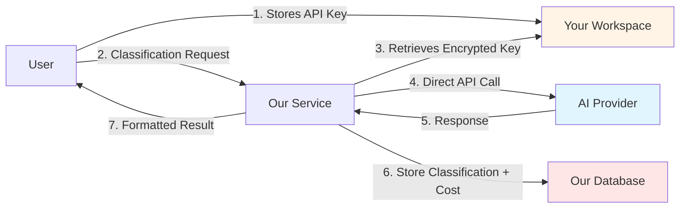
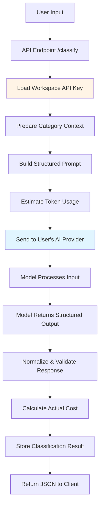

# AI Classification Service

> A flexible, AI-powered classification service designed to interpret unstructured input and map it into structured categories for various business use cases

## 🎯 TL;DR

This service uses AI to automatically classify text inputs (issue reports, employee profiles, requests) into predefined categories with explanations and confidence scores. Built with a provider-agnostic architecture supporting **BYOK**, it's designed for multiple domains: IT support, HR workflows, salary structures, and more.

---

## 📊 Current Status

- ✅ Initial monorepo setup complete (based on [starter-kit](https://github.com/yurisasc/starter-kit))
- ✅ OpenRouter API integration with Hono + LangChain
- ✅ BYOK architecture design
- 🚧 Building classification prompt templates
- 🚧 API key management system
- ⏳ Category knowledge store design
- ⏳ Response normalization layer
- ⏳ Frontend UI for testing

---

## 🔑 BYOK (Bring Your Own Key)

### Why BYOK?

**Cost Control & Provider Flexibility**: Users connect their own AI provider API keys directly, ensuring:

- ✅ **Direct cost transparency** - Pay only your provider's API costs, no markup
- ✅ **Full usage visibility** - See all AI spending in your provider dashboard
- ✅ **Provider flexibility** - Switch between OpenAI, Anthropic, OpenRouter anytime
- ✅ **No shared key limitations** - Your own rate limits, quotas, and billing
- ✅ **Model preference control** - Use specific models or versions you prefer
- ✅ **Simple pricing model** - We charge only for platform features, not AI usage

### Important: What BYOK Does NOT Solve

BYOK focuses on cost and provider control. We still store:
- ✅ Classification requests and responses (for analytics and history)
- ✅ Token usage and cost tracking (for your workspace dashboard)
- ✅ Category definitions and business rules (your domain knowledge)
- ✅ User input text (which may contain sensitive information)

### Supported AI Providers

| Provider | Models Supported | Setup Difficulty |
|----------|-----------------|------------------|
| OpenRouter | 200+ models | ⭐ Easy |
| OpenAI | GPT-4, GPT-3.5 | ⭐ Easy |
| Anthropic | Claude 3.5, Claude 3 | ⭐ Easy |
| Azure OpenAI | GPT-4, GPT-3.5 | ⭐⭐ Medium |
| Custom Endpoint | Any OpenAI-compatible API | ⭐⭐⭐ Advanced |

### How BYOK Works


```mermaid
flowchart LR
    A[User] -->|1. Stores API Key| B[Your Workspace]
    A -->|2. Classification Request| C[Our Service]
    C -->|3. Retrieves Encrypted Key| B
    C -->|4. Direct API Call| D[AI Provider]
    D -->|5. Response| C
    C -->|6. Store Classification + Cost| E[Our Database]
    C -->|7. Formatted Result| A
    
    style D fill:#e1f5ff
    style B fill:#fff4e6
    style E fill:#ffe6e6
```

**What we handle:**
- Prompt engineering & templates
- Request routing & validation
- Response normalization
- UI & workspace management
- Token estimation & cost tracking
- Classification history & analytics

**What you control:**
- Your AI provider API keys (encrypted at rest)
- Which AI provider/model to use
- Your direct billing with AI providers
- Rate limits from your provider account

---

## 💡 Core Concept

The service receives unstructured text and classifies it into predefined categories using curated domain knowledge. Instead of hardcoding business logic, we let AI interpret and map inputs while maintaining full transparency and auditability.

### Example Use Cases

- **IT Operations**: Categorize support tickets (Network, Hardware, Software, Security)
- **HR Management**: Suggest salary structures based on employee profiles
- **Performance Reviews**: Classify feedback into performance tiers
- **Document Routing**: Auto-categorize incoming documents for proper workflow

### Quick Example

**Input Request:**
```json
{
  "text": "My laptop won't connect to WiFi after the latest update",
  "domain": "it-support"
}
```

**Classification Response:**
```json
{
  "category": "Network Connectivity",
  "confidence": 0.89,
  "explanation": "Issue involves WiFi connection problems following a system update. Likely driver or configuration related.",
  "suggestedPriority": "medium",
  "metadata": {
    "matchedCriteria": ["wifi", "connectivity", "update"],
    "modelVersion": "gpt-4-turbo",
    "provider": "openrouter",
    "tokensUsed": 245,
    "estimatedCost": "$0.0012",
    "timestamp": "2024-11-19T10:30:00Z"
  }
}
```

---

## 🏗️ Architecture Overview

The system follows a modular, layered architecture with BYOK at its core:

### 1. Input Layer
Accepts text from any source: web apps, APIs, internal tools, browser extensions, CLI tools.

### 2. Workspace & Key Management
Each workspace contains:
- Encrypted AI provider API keys
- Custom category collections
- Usage analytics
- Team member access controls

### 3. Knowledge & Category Store
Contains curated domain knowledge:
- Category definitions and descriptions
- Classification criteria
- Domain-specific rules
- Constraint definitions

This acts as a mini "domain knowledge base" that gives the AI model context.

### 4. AI Connector Layer (BYOK-Enabled)
Provider-agnostic layer that:
- Retrieves user's encrypted API key
- Constructs structured prompts
- Makes **direct API calls to user's provider**
- Handles responses and errors
- Enables easy provider switching (OpenAI, Anthropic, OpenRouter, etc.)

### 5. Classification Core
Applies business logic:
- Prepares category context from knowledge store
- Maps inputs to appropriate categories
- Enforces output schema validation
- Normalizes model responses
- Tracks token usage and costs

### 6. Client Layer
Any interface consuming classification results: dashboards, UIs, integrations.

---

## 🔄 Classification Flow with BYOK


```mermaid
flowchart TD
    A[User Input] --> B[API Endpoint /classify]
    B --> C[Load Workspace API Key]
    C --> D[Prepare Category Context]
    D --> E[Build Structured Prompt]
    E --> F[Estimate Token Usage]
    F --> G[Send to User's AI Provider]
    G --> H[Model Processes Input]
    H --> I[Model Returns Structured Output]
    I --> J[Normalize & Validate Response]
    J --> K[Calculate Actual Cost]
    K --> L[Store Classification Result]
    L --> M[Return JSON to Client]
    
    style C fill:#fff4e6
    style G fill:#e1f5ff
```

### Step-by-Step Process

1. **Input Received** - Raw text arrives via API with workspace context
2. **Key Retrieval** - Fetch and decrypt user's AI provider API key
3. **Context Preparation** - Load relevant categories, criteria, and rules
4. **Prompt Construction** - Build structured prompt with input + context
5. **Token Estimation** - Estimate request cost before sending
6. **AI Classification** - Send directly to user's AI provider
7. **Response Normalization** - Validate and format for client consumption
8. **Usage Tracking** - Log tokens used and estimated cost (optional)

---

## 🗂️ Project Structure

```
ai-classifier/
├── apps/
│   ├── api/              # REST API server (Hono)
│   │   ├── routes/
│   │   │   ├── classify.ts      # Main classification endpoint
│   │   │   ├── workspaces.ts    # Workspace management
│   │   │   └── api-keys.ts      # BYOK key management
│   │   ├── services/
│   │   │   ├── encryption.ts    # API key encryption
│   │   │   ├── providers.ts     # AI provider connectors
│   │   │   └── token-estimator.ts
│   ├── auth/             # Authentication server (Better Auth)
│   ├── docs/             # Documentation site (Fumadocs)
│   └── mcp/              # MCP server for AI integration
├── packages/
│   ├── biome-config/     # Shared linting/formatting
│   ├── database/         # Database client & migrations
│   │   ├── schema/
│   │   │   ├── workspaces.ts    # Workspace schema
│   │   │   ├── api_keys.ts      # Encrypted API keys
│   │   │   └── classifications.ts
│   │   └── categories/   # Category definitions by domain
│   └── typescript-config/# Shared TypeScript config
└── specs/                # Feature specs & documentation
```

---

## 🗄️ Database Schema for BYOK

```typescript
// Workspaces table
table workspaces {
  id: varchar [pk]
  name: varchar
  owner_id: varchar [ref: > users.id]
  created_at: timestamp
  updated_at: timestamp
}

// API Keys table (encrypted)
table api_keys {
  id: varchar [pk]
  workspace_id: varchar [ref: > workspaces.id]
  provider: varchar // 'openrouter', 'openai', 'anthropic'
  key_encrypted: text // Encrypted API key
  key_hash: varchar // For validation without decryption
  model_preference: varchar // Default model to use
  is_active: boolean
  created_at: timestamp
  last_used: timestamp
}

// Classifications table
table classifications {
  id: varchar [pk]
  workspace_id: varchar [ref: > workspaces.id]
  input_text: text
  category: varchar
  confidence: decimal
  explanation: text
  provider_used: varchar
  model_used: varchar
  tokens_used: integer
  estimated_cost: decimal
  created_at: timestamp
}

// Workspace members
table workspace_members {
  workspace_id: varchar [ref: > workspaces.id]
  user_id: varchar [ref: > users.id]
  role: varchar // 'owner', 'admin', 'member'
  created_at: timestamp
}
```

**Key Security Features:**
- One API key = access to ONE workspace's collections
- API keys encrypted at rest using AES-256-GCM
- Keys never logged or transmitted in plain text
- Key hashes used for quick validation
- User can have multiple keys for different workspaces

---

## 🚀 Quick Start

### Prerequisites

- Node.js (v18+)
- pnpm (v9.0.0+)
- Docker
- Your own AI provider API key (OpenRouter, OpenAI, or Anthropic)

### Installation

```bash
# Clone the repository
git clone [your-repo-url]
cd ai-classifier

# Install dependencies
pnpm install

# Setup environment variables
pnpm setup:env

# Generate encryption key for API keys
node scripts/generate-encryption-key.js

# Start PostgreSQL database
docker run -d \
  --name auth-postgres \
  -e POSTGRES_PASSWORD=password \
  -e POSTGRES_DB=auth_db \
  -p 5432:5432 \
  postgres:18

# Setup database schema
pnpm db:setup

# Start development servers
pnpm dev
```

### Setting Up Your First Workspace

1. **Create Account**: Visit http://localhost:3001 and sign up
2. **Create Workspace**: Navigate to "Workspaces" → "New Workspace"
3. **Add API Key**: 
   - Go to "Settings" → "AI Provider"
   - Select provider (OpenRouter/OpenAI/Anthropic)
   - Paste your API key
   - Choose default model
4. **Test Classification**: Use the playground to test your first classification

### Access Points

- **Documentation**: http://localhost:3000
- **Auth Server**: http://localhost:3001
- **API Server**: http://localhost:3010
- **Drizzle Studio**: https://local.drizzle.studio

---

## 🛠️ Technology Stack

### Why These Technologies?

- **Hono**: Lightweight, edge-ready, TypeScript-first framework
- **LangChain**: Structured prompt management and AI workflow orchestration
- **BYOK Architecture**: Maximum data privacy without vendor lock-in
- **PostgreSQL + Drizzle ORM**: Type-safe database operations
- **Better Auth**: Modern authentication with JWT validation
- **Turborepo**: Efficient monorepo builds and caching

### Core Dependencies

- **Backend**: Hono, FastMCP, Better Auth, LangChain
- **Database**: PostgreSQL with Drizzle ORM
- **Security**: Node crypto for API key encryption
- **Frontend**: React with Fumadocs UI
- **Build Tools**: Turborepo with pnpm workspaces
- **Dev Tools**: Docker, Drizzle Studio, Scalar API docs

---

## 📖 Key Concepts

### Category Structure

Each category in the knowledge store includes:

```typescript
{
  id: string;
  name: string;
  description: string;
  criteria: string[];
  constraints?: string[];
  severity?: "low" | "medium" | "high" | "critical";
  examples: string[];
}
```

### Response Schema

```typescript
{
  category: string;
  explanation: string;
  confidence: number; // 0-1 scale
  metadata: {
    matchedCriteria: string[];
    provider: string;
    modelVersion: string;
    tokensUsed: number;
    estimatedCost: string;
    timestamp: string;
  }
}
```

### API Key Encryption

```typescript
// Encryption service
class APIKeyEncryption {
  encrypt(apiKey: string): { encrypted: string; hash: string }
  decrypt(encrypted: string): string
  verify(apiKey: string, hash: string): boolean
}
```

---

## 🔒 Security Best Practices

1. **API Key Storage**
   - Always encrypted at rest using AES-256-GCM
   - Never logged in plain text
   - Rotation supported via UI

2. **Access Control**
   - Workspace-level isolation
   - Role-based permissions (owner, admin, member)
   - API key access restricted to workspace members

3. **Data Privacy**
   - Classification data stored per workspace
   - Option to disable classification logging

4. **Rate Limiting**
   - Per-workspace rate limits
   - Prevent API key abuse
   - Cost controls and alerts

---

## 🎨 Design Philosophy

1. **Cost Transparency First**: BYOK means users pay AI providers directly with no markup
2. **Avoid Over-Engineering**: Start simple, add complexity only when needed
3. **Inspectable & Auditable**: Every classification includes reasoning and cost tracking
4. **AI for Interpretation Only**: Business logic stays in code, not in prompts
5. **Domain Knowledge First**: Organizations define their own categories
6. **Provider Agnostic**: Easy to switch AI providers via BYOK
7. **Build in the Open**: Document decisions and iterate transparently

---

## 🔮 Roadmap

### Phase 1: Core Classification with BYOK (Current)
- ✅ Basic API structure with Hono
- ✅ BYOK architecture design
- 🚧 API key encryption & management
- 🚧 Prompt template system
- 🚧 Multi-provider support
- ⏳ Category knowledge store
- ⏳ Response validation
- ⏳ Token estimation & cost tracking

### Phase 2: Enhanced Features
- Multi-domain support
- Confidence thresholds and fallbacks
- Classification history and analytics
- A/B testing for prompt variations
- Custom model fine-tuning support
- Batch classification API

### Phase 3: Production Ready
- Rate limiting and caching
- Model performance monitoring
- Advanced cost tracking per classification
- Admin dashboard for category management
- Workspace usage analytics
- SSO integration

### Phase 4: Enterprise Features
- Audit logs
- Compliance reporting (SOC2, HIPAA)
- On-premise deployment options
- Advanced access controls
- SLA monitoring

---

## 🤝 Development Workflow

1. Define new category set in `packages/database/categories/[domain].ts`
2. Create prompt template in `apps/api/prompts/[domain].ts`
3. Test classification logic with sample inputs
4. Update API documentation
5. Deploy and monitor

---

## 📚 Documentation

Full documentation is available at http://localhost:3000 when running locally, including:

- Installation guide
- BYOK setup guide
- API reference
- Architecture deep-dive
- Security best practices
- Contributing guidelines

---

## 💰 Cost Transparency

Since users bring their own API keys, all AI costs are transparent and direct:

| Provider | Model | Cost per 1M tokens (input) | Cost per 1M tokens (output) |
|----------|-------|---------------------------|----------------------------|
| OpenRouter | GPT-4 Turbo | $10 | $30 |
| OpenAI | GPT-4 Turbo | $10 | $30 |
| Anthropic | Claude 3.5 Sonnet | $3 | $15 |
| OpenRouter | Claude 3.5 Sonnet | $3 | $15 |

**Our service pricing**: 
- Platform fee: $0.01 per classification (for our infrastructure, storage, and features)
- AI costs: Billed directly by your provider (no markup from us)

**Example**: 1,000 classifications using Claude 3.5 Sonnet (~500 tokens each)
- AI Provider cost: ~$1.50 (your direct payment to Anthropic/OpenRouter)
- Platform fee: $10.00 (paid to us)
- **Total: $11.50**

---

## 🙏 Acknowledgments

This project is built on top of the excellent [starter-kit monorepo](https://github.com/yurisasc/starter-kit) by Yuris Aryansiah. It provides a modern tech stack with simple setup and great documentation - perfect for getting started with monorepo architecture.

---

## 📝 License

[Add your license here]

---

## TODO

- [ ] Token estimation for predefined categories/descriptions
- [ ] Token estimation for predefined categories/descriptions + input
- [ ] Write comparison of allowed token counts for popular AI models
- [ ] Implement API key rotation system
- [ ] Build provider health check system
- [ ] Create cost alert system for workspaces
- [ ] Add support for custom AI endpoints
- [ ] Build classification playground UI
- [ ] Implement job queue for async classifications
- [ ] Add webhook support for classification results

---

**Built with ❤️ as a learning project in the open**
